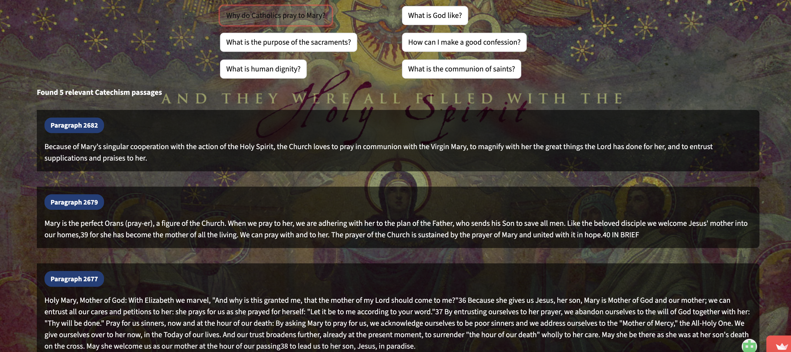

# Catechism of the Catholic Church Search

A semantic search application for exploring the *Catechism of the Catholic Church* using modern natural language processing techniques. This project enables users to ask theological and doctrinal questions in natural language and retrieve relevant Catechism paragraphs ranked by semantic relevance.

The application is built with **Python** and **Streamlit**, and combines dense vector search, sparse retrieval, and cross-encoder re-ranking for improved accuracy and interpretability.

---

## Overview

The *Catechism of the Catholic Church* is a comprehensive and authoritative summary of Catholic teaching, but its depth and structure can make intuitive searching difficult. This project aims to support learning and exploration by allowing users to:

- Ask natural-language questions about Catholic doctrine and practice  
- Retrieve relevant Catechism paragraphs beyond exact keyword matches  
- Explore Church teaching in a structured, searchable, and transparent way  

This tool is intended for **educational and exploratory purposes only** and does not replace official Church teaching, pastoral guidance, or spiritual direction.

---

## Application Interface

### Main Search Page

The main page allows users to enter a free-form question, adjust the number of results to display, and select from example questions covering common theological topics.


---

### Results View

Search results display ranked Catechism paragraphs that are most relevant to the user’s question, based on combined lexical and semantic scoring.



---

## How the Search Works

The application uses a hybrid retrieval pipeline:

### BM25 (Lexical Search)
Provides strong baseline retrieval for exact terms and doctrinal language commonly used in the Catechism.

### SentenceTransformer Embeddings
Encodes Catechism paragraphs and user queries into dense vector representations to capture semantic meaning.

### FAISS Vector Index
Enables efficient similarity search across all Catechism embeddings.

### CrossEncoder Re-ranking
Re-scores top candidate passages to improve contextual accuracy and ranking quality.

This combination balances precision, recall, and theological fidelity.

---

## Tech Stack

- Python  
- Streamlit  
- SentenceTransformers  
- FAISS  
- BM25  
- CrossEncoder  
- NumPy / Pandas  

---

## Repository Structure

```text
catechism_search/
├── .streamlit/
│   └── config.toml
├── data/
│   └── catechism_clean_structured.jsonl
├── embeddings_store/
│   ├── catechism_embeddings.npy
│   ├── catechism_faiss.index
│   └── catechism_metadata.pkl
├── images/
│   ├── overview.png
│   └── answers.png
├── catechism_streamlit.py
├── requirements.txt
├── LICENSE
└── README.md

## License

This project is licensed under the MIT License. See the LICENSE file for details.

## Notes and Limitations

Search results reflect similarity and relevance, not doctrinal priority or completeness

The application does not generate new theological content; it retrieves and ranks existing Catechism text

Users are encouraged to consult the full Catechism and authoritative Church sources for deeper study

